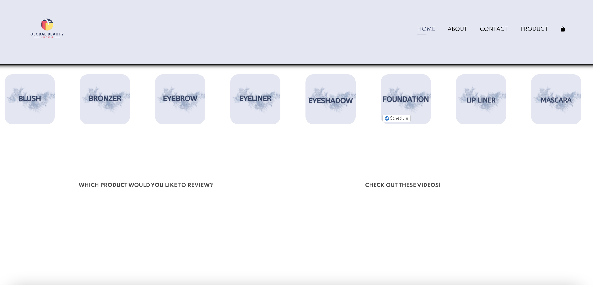
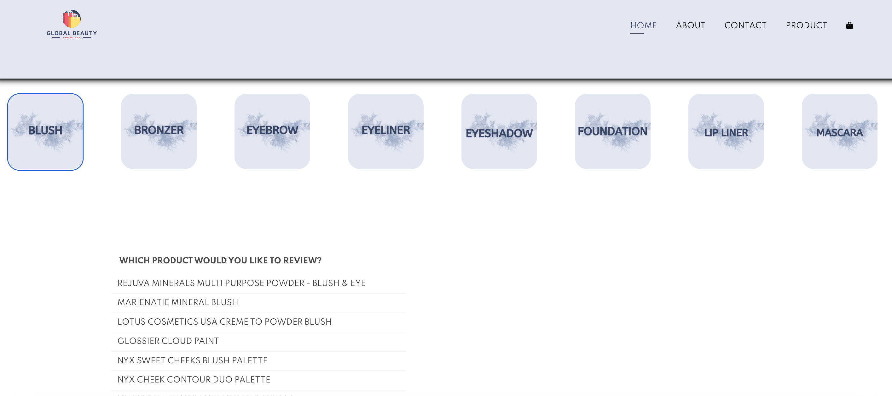
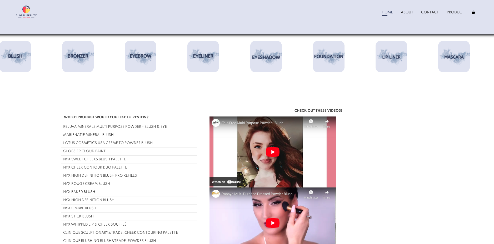
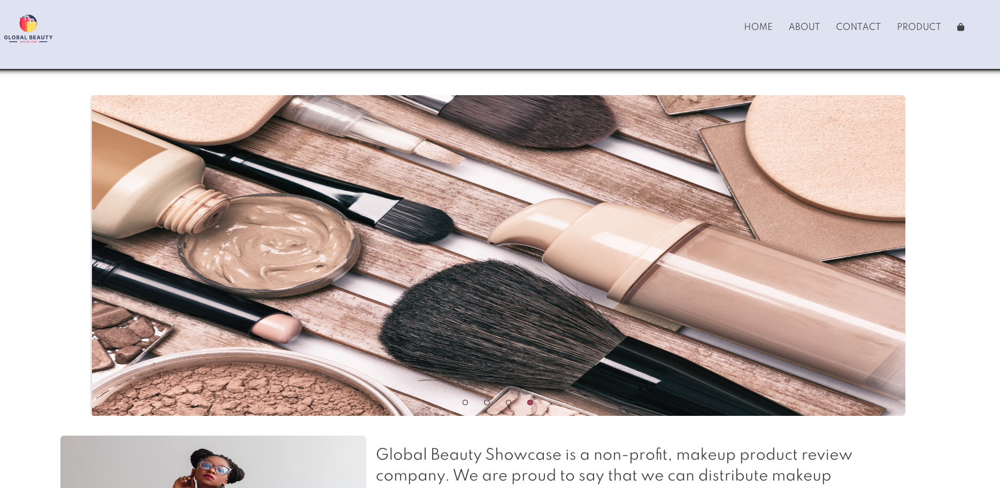
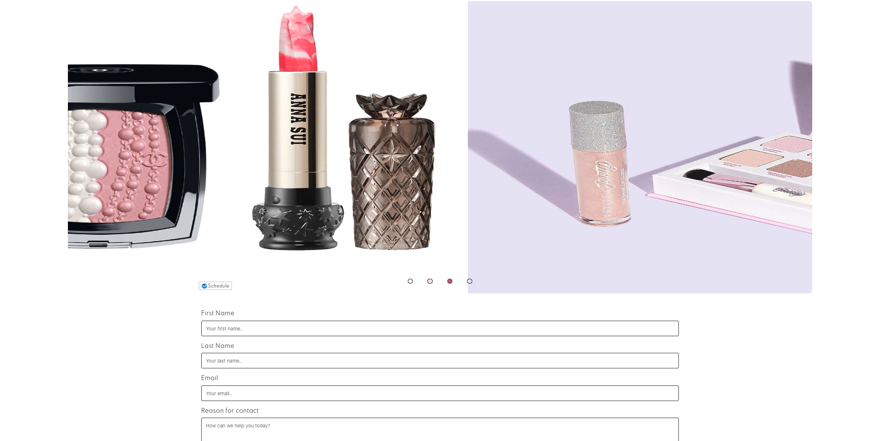

# Group Project Global-Beauty-Showcase
This is a group project completed by Daniel Aguilera, Corbin Cutter and Janaee Wallace for the Georgia Tech Coding Bootcamp. The project requirements included:
1. Must use at least two server-side APIs
2. Must use a CSS framework other than Bootsrap
3. Must use client-side storage to store persistent data
4. Must have a polished UI
5. Must meet good quality coding standards (intention, scoping, naming, etc.)
6. Must not use alerts, confirms, or prompts (look into modals)
7. Must be deployed to GitHub Pages
8. Must be interactive (i.e., accept and respond to user input)

# Technology Used
APIs used:
Makeup Brands API - https://makeup-api.herokuapp.com/
YouTube Search API - https://developers.google.com/youtube/v3/docs/search/list

Sources: 
https://mixedanalytics.com/blog/list-actually-free-open-no-auth-needed-apis/ 
https://coding-boot-camp.github.io/full-stack/apis/api-resources 

CSS Framework:
https://bulma.io/ 


# Backlog (Features):

## HOME PAGE
Owner: Daniel

User Stories & Acceptance Criteria
```
1. As a Global Beauty User, I to see a persistent Navbar across all the pages on the Global Beauty Brand site to easily navigate across pages
	Given users will need to navigate across pages
	When a user is on every web page on beauty brand
	Then they will see the same nav bar with About, Contact, and Product Buttons that will navigate them to their respective pages
	Persistent Footer

2. As a Global Beauty User, I to see a persistent footer across all the pages on the Global Beauty Brand site to easily navigate across pages
	Given users will need to navigate across pages
	When a user is on every web page on beauty brand
	Then they will see the same footer with About, Contact, Product Buttons, and Copyright Notice

3. As a Global Beauty User, I to see a persistent jumbotron image on the homepage
	Given users want a pleasing homepage
	When a user lands on the global beauty homepage
	Then they will see a persistent image on the homepage

4. As a Global Beauty User, when viewing the home page, I want to be able to click a button to be navigated to the product page where I can select which type of beauty product I want to review
	Given users can select different beauty products to review 
	When a user navigates to the beauty home page
	Then they will be able to click a button and be navigated to the product page
```

## PRODUCT PAGE
Owner: Janaee

User Stories & Acceptance Criteria
```
1. As a Global Beauty User, I want when I click the Product thumbnail on the navbar to be redirected to an unfiltered product page
	Given users can select different pages from the nav bar
	When a user selects the product page
	Then they will be navigated to the product page

2. As a Global Beauty User, when viewing the product page, I want to be able to click a button to select which type of beauty product I want to review
	Given users can select different beauty products to review 
	When a user navigates to the beauty product page
	Then they will be able to choose the type of beauty product they want to review (Blush, Bronzer, Eyebrow, Eyeliner, Eyeshadow, Foundation, Lip Liner, Mascara)

3. As a Global Beauty User, when I click the product type on the product page, I want to trigger the Makeup API to provide a list of beauty brands pre-populated based on the selected type
	Given users can select the product type from the product page
	When a user clicks a specific product type button
	Then they will trigger the makeup API to fetch the list of beauty brands associated with that product type 

4. As a Global Beauty User, after I clicked the brand that I want, I want to see a list of different products of that type that that brand offers so I can select the product I want
	Given users can select the specific brand that they want
	When a user selects the brand
	Then they will see the list of products that match the brand and the type
		
5. As a Global Beauty User, after I have selected the product type and brand that I want, I want to see a list of YouTube Videos related to that product type and brand
	Given users can select the specific brand and product type that they want
	When a user selects a button to view tutorials
	Then they will see the list of YouTube video links and video thumbnails related to their search
6. As a Global Beauty User, after I have selected the video related to the product type and brand that I want, I want to be able to view the video on the website without leaving the page
	Given users can select the specific product review video they want
	When a user selects a YouTube video to watch
	Then the video will play on the page
```

## CONTACT US PAGE
Owner: Corbin

User Stories & Acceptance Criteria
```
1. As a Global Beauty User, when I click the “Contact Us” button in the NAV bar on the home page, I want to be sent to the “Contact Us” page that includes a jumbotron slideshow of product pictures to view as well as a way for me to contact the website owners.
		
2. As a Global Beauty User on the “Contact Us” page, I want to be able to input my email and a reason for contact so that I can get in touch with the website owners.	
	Given, users can input their email as a point of contact for the owners to write back.
	When, a user inputs their email into the email input bar,
	Then, their email will be sent to our “Message Center” in the back end (which won’t exist).

	Given, users can input a reason for contact so that the website owners have an understanding of the concern.
	When, a user inputs their reason for contact into the “How can we help you today?” box,
	Then, their reason for contact is sent to our backend “Message Center” (which won’t exist).

	Given, users can input their email and reason for contact in their respective areas.
	When, a user clicks the send button,
	Then, a browser alert is shown with a message that says “Message sent!”

	Give, users will be inputting their requests to Global Beauty
	When they submit a contact us form
	Then, the contact us form data will be stored in local storage so that the user can see the history of messages that were sent

	Given, local storage will hold the history of messages sent
	When, the user reviews the contact us page
	Then, there will be a history of messages sent displayed with relevant information

3. As a Global Beauty User on the “Contact Us” page, I am greeted with a slideshow that contains pictures of makeup products that switches every 2 seconds.
```

## ABOUT US PAGE
Owner: Corbin

User Stories & Acceptance Criteria
```
1. As a Global Beauty User, when I click the “About Us” button in the NAV bar on the home page, I want to be sent to the “About Us” page that includes a jumbotron slideshow of product pictures to view as well sections of information about the website and the brand.

2. As a Global Beauty User on the “About Us” page, I want to view sections of information about the website and the “Global Beauty” brand.

3. As a Global Beauty User on the “About Us” page, I am greeted with a slideshow that contains pictures of makeup products that switches every 2 seconds. (Pics here are different than the ones on the “Contact Us” page)
```

## Application Functionality
The following animation demonstrates the application functionality:







## Deployed Application Link
https://danaguilera.github.io/Global-Beauty-Showcase/